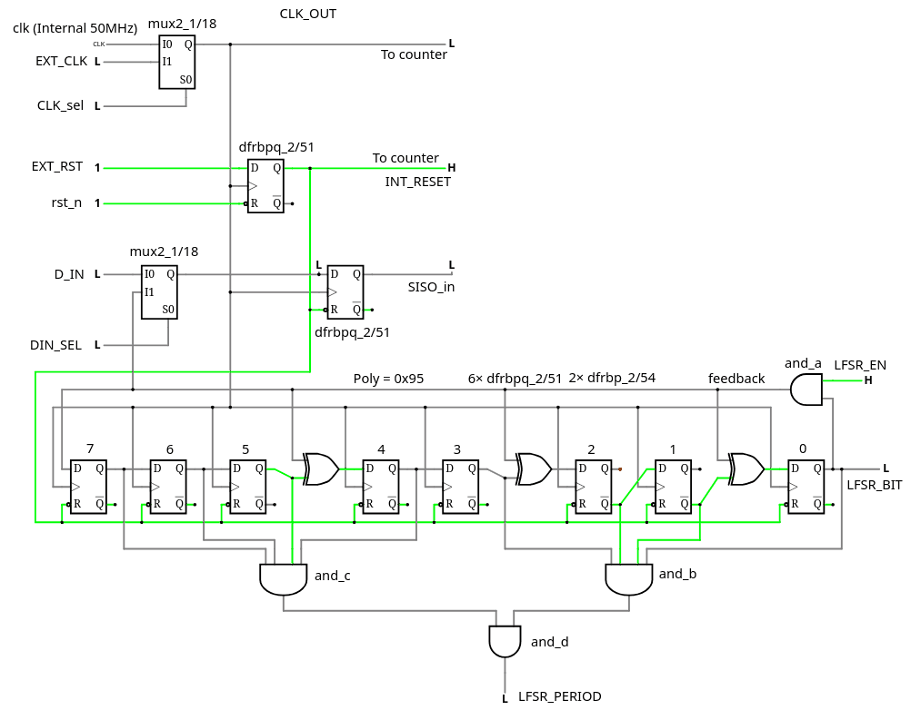

## How it works

As the name implies, it's a high density shift register for deep digital delays. According to the PDK for CMOS IHP at
https://github.com/IHP-GmbH/IHP-Open-PDK/blob/main/ihp-sg13g2/libs.ref/sg13g2_stdcell/doc/sg13g2_stdcell_typ_1p20V_25C.pdf

* Area of sg13g2_dfrbpq_1 : 48.98880
* Area of sg13g2_mux2_1 : 18.14400

MUX2 is almost 3× smaller than the DFF gate and could be used as a latch (which is larger, what the hail ?). This implementation uses 4 MUX-latches to store 3 bits at a given time and non-overlapping "clock" pulses perform the shifting.

Compared to a normal DFF, it could store twice the same amount of bits per unit of surface, as the controller's size becomes insignificant as the chain gets longer. Depths of several kilobits are possible without too much hassles (if the synth agress), without a mad clock network, reducing simultaneous switching noise...

The apparent complexity comes from the 8-phase clock, which is brought to the "asynchronous" domain and the 8 pulses. Each of the 8 lanes is 8× slower (which relaxes timing constraints) but the overall throughput is preserved. So it "should" work at "full speed", I expect 50MHz to work (more or less).

For implementation, I use the Verilog workflow and instatiate cells directly from
https://github.com/IHP-GmbH/IHP-Open-PDK/blob/main/ihp-sg13g2/libs.ref/sg13g2_stdcell/verilog/sg13g2_stdcell.v

## How to test

WARNING : This is highly experimental, only a first shot and also my first tapeout! I have a long experience in FPGA design, so I am confident (too confident?) but the edges are very rough and the EDA tools do not cooperate. Also I learn Verilog and I miss VHDL...

* Clock and Reset can be asserted by external pins and internal signals.
* The pin CLK_OUT copies the currently selected clock, for external triggering and troubleshooting. If it oscillates, it should work.
* External reset EXT_RST (asserted at 0 like the internal one) overrides the internal reset, don't let it float. A weak pull-up to 1 is advised.
* External clock (pin EXT_CLK) can be selected when pin CLK_SEL=1 (don't let them float).
* Always assert EXT_RST (to 0) while changing the state of CLK_SEL.
* Startup sequence: EXT_RST asserted (0), choose CLK_SEL's value, run that clock, then release EXT_RST (to 1, and RESET is internally clock-resynchronised so give it a cycle to come into effect)
* Input a '1' or a '0' on D_IN, and observe the value appearing on D_OUT after a number of clock cycles (hopefully around 255)

Extra insight and observability:
* When SHOW_LFSR=0, the IO port shows the 8 internal staggered pulses, turning from 0 to 1 and back to 0 in a linear sequence. It's just like a 4017 but 8 bits, since it's a Johnson counter too.
* 4 output pins provide the internal state of that 4-bit Johnson counter, or ring counter, thus you should observe a pretty pattern where only one pin changes at each clock cycle.

## Bonus: LFSR

An 8-bit LFSR is also integrated to ease testing. Thus an oscilloscope and a variable frequency oscillator are enough to characterise the achieveable speed. To use it,

* Assert the external reset EXT_RST (0)
* Select the desired clock (CLK_SEL)
* Unlock the internal LFSR by asserting pin LFRS_EN to 1
* Assert pin DIN_SEL (1) to internally route the LFSR bitstream to the SISO input
* Run the clock (internal or external, depending on CLK_SEL)
* Release EXT_RST (1) (now it should be started)
* Connect an oscilloscope to probe the signals D_OUT and LFSR_BIT while triggering on LFSR_PERIOD (which pulses every 255 clock cycles)
* See if both traces match.
* Send me pictures of your scope traces!

Note: 8 bits gives a period of 255, the SISO is not exactly that deep, so a small shift is expected.

Note 2: The LFSR_PERIOD pulse should appear 193 clock cycles after the release of the RESET pin.

## External hardware

A basic custom test board will be put together, to hook the variable frequency generator and the oscilloscope probes.

Optionally, if you only want to make a "light chaser", hook 8 LED to the IO port, select the external clock and add a 555. Or you can have a more funky pattern by displaying the LFSR's state by setting SHOW_LFSR to 1.
